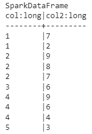

# Знакомство с Fugue - уменьшаем шероховатости при работе с PySpark

Автор
статьи: [Kevin Kho](https://towardsdatascience.com/introducing-fugue-reducing-pyspark-developer-friction-a702230455de)

*Повышение производительности разработчиков и снижение затрат на проекты Big Data*


## Мотивация

Специалисты по обработке данных часто начинают работать с Pandas или SQL. Рано или поздно объем обрабатываемых данных
превосходит возможности Pandas, и возникает необходимость в распределенных вычислениях. Одним из таких инструментов
является Spark, популярная система распределенных вычислений, которая позволяет обрабатывать большие объемы данных в
памяти на кластере машин. Хотя механизм Spark очень мощный для масштабирования конвейеров данных, существует множество
подводных камней, с которыми сталкиваются новички и даже опытные пользователи при использовании Spark.

Вполне ожидаемо, что первоначальная трудность заключается в необходимости изучения совершенно нового фреймворка.
Синтаксис и использование Spark и Pandas сильно отличаются. Пользователи, переносящие проекты с Pandas на Spark, часто
сталкиваются с необходимостью переписать большую часть кода, даже для той же самой логики приложения. Хуже того,
некоторые операции, которые в Pandas выполняются тривиально, в Spark становятся намного сложнее и требуют много времени
для реализации.

**Простой пример подобной операции - получение медианы для каждой группы данных.** В Pandas нет необходимости долго думать о методе получения медианы для каждой группы. Однако в Spark эта операция не так проста. Мы сравним синтаксис двух
фреймворков в приведенном ниже фрагменте кода:

```python
# Pandas
df.groupby("col1")["col2"].median()

# PySpark
from pyspark.sql import Window
import pyspark.sql.functions as F

med_func = F.expr('percentile_approx(col2, 0.5, 20)')
df.groupBy('col1').agg(med_func).show()
```

Такое несоответствие синтаксиса объясняется тем, что вычисление медианы в распределенной среде требует больших затрат.
Все данные, принадлежащие одной группе, должны быть перенесены на одну машину. Таким образом, перед получением медианы
данные необходимо перетасовать и отсортировать. Чтобы снизить затраты на вычисления, можно получить приблизительную
медиану с заданным допуском. В приведенном фрагменте 20 - это точность, то есть относительная ошибка может составлять
1/20, или 5%. Уточнение допуска позволяет пользователям найти баланс между точностью и скоростью.

Помимо разницы в синтаксисе, **в распределенной среде существуют важные понятия (такие как разделение, перемешивание,
сохранение и ленивые вычисления)**, о которых пользователи Pandas изначально не знают. Эти концепции требуют
значительного времени для изучения и освоения, что затрудняет полноценное использование движка Spark.

[Fugue](https://github.com/fugue-project/fugue), слой абстракции с открытым исходным кодом, обеспечивает бесшовный
переход от окружения с одной машиной к вычислениями в распределенной среде. С помощью Fugue пользователи могут
кодировать свою логику на родном языке Python, Pandas или SQL, а затем передавать ее в движок Spark (или Dask) для
исполнения. Это означает, что **пользователям даже не нужно изучать синтаксис Spark, чтобы использовать Spark.**


В этой статье мы обсудим болевые точки, с которыми сталкиваются пользователи Spark, и то, как Fugue решает эти проблемы.
**Fugue - это прямой результат нескольких лет размышлений о том, как можно улучшить работу разработчиков Spark.** Помимо
обеспечения более простого интерфейса для кодирования в Spark, есть и более ощутимые преимущества, которые дает
использование слоя абстракции. Здесь мы покажем, как Fugue:

- Справляется с несовместимостью между различными вычислительными фреймворками (Pandas, Spark и Dask)
- Обеспечивает возможность повторного использования кода как для данных, помещающихся в Pandas, так и для данных, для
  которых необходимо использование Spark
- Значительно ускоряет тестирование и снижает общую стоимость проекта
- Позволяет новым пользователям гораздо быстрее начать продуктивную работу с Spark
- Предоставляет SQL-интерфейс, способный обрабатывать сквозные рабочие процессы от начала до конца

## Несовместимость между Pandas и Spark

*Может ли быть единый интерфейс для больших и малых данных?*

Пользователи Pandas, переходящие на Spark, часто сталкиваются с противоречивым поведением. Во-первых, Pandas допускает
смешанные типы столбцов. Это означает, что строки и числа могут быть смешаны в одном столбце. В Spark schema строго
соблюдается, и столбцы смешанного типа не допускаются. Это связано с тем, что Pandas обладает роскошью видеть все данные
в процессе выполнения операций, в то время как Spark выполняет операции на нескольких машинах, на которых хранятся
различные части данных. Это означает, что Spark может легко заставить разные разделы вести себя по-разному, если schema
не будет строго соблюдаться.

Значения NULL также обрабатываются по-разному в Pandas и Spark. В таблице ниже приведена сводная информация об обработке
значений NULL по умолчанию


Это первое преимущество использования Fugue в качестве слоя абстракции. Преобразовать код Pandas в годный для работы на
Spark - это одно дело, однако написание кода, дающего согласованные результаты между разными инструментами, это очень утомительный
процесс. Во многих случаях для получения одинаковых результатов приходится писать дополнительный код. Fugue заботится о
согласованности, чтобы создать мост между Pandas и Spark. Fugue был разработан для совместимости со Spark и SQL,
поскольку это гарантирует, что код будет работать так, как и ожидается. **Пользователи не должны тратить свое время,
заботясь о поведении, специфичном для конкретного фреймворка.**

## Развязка логики и исполнения

*Почему я должен выбирать фреймворк прежде, чем начинать проект по работе с данными?*

Одна из проблем при использовании Pandas и Spark заключается в том, что логика тесно связана с интерфейсом. Это
непрактично, поскольку требует от специалистов по работе с данными выбора, с чем они будут работать, уже на начальном
этапе проекта. Вот два сценария, которые представляют две стороны одной и той же проблемы.

1. Пользователь пишет код в Pandas, а затем данные становятся слишком большими. Чтобы решить эту проблему, необходимо
   модернизировать базовое оборудование для поддержки исполнения кода (вертикальное масштабирование).
2. Пользователь кодирует в Spark, ожидая, что данные будут большими, но они никогда не вырастают до размера, требующего
   Spark. Код и тесты работают медленнее, чем должны, из-за накладных расходов на Spark.

В обоих сценариях пользователь в итоге использует не тот инструмент, который нужен для работы. Этих сценариев можно
избежать, если разделить логику и исполнение. **Использование Fugue в качестве уровня абстракции позволяет пользователям
писать одну кодовую базу, совместимую как с Pandas, так и со Spark.** Фреймворк, на котором исполняется код, может быть
уточнен во время выполнения программы путем указания конкретного движка. Чтобы продемонстрировать это, давайте
рассмотрим самый простой способ использования Fugue - функцию `transform()`.

Для данного примера у нас есть DataFrame со столбцами `id` и `value`. Мы хотим создать столбец под названием `food`
путем сопоставления `value` с соответствующим `food` в словаре `mapping`.

```python
import pandas as pd
from typing import Dict

input_df = pd.DataFrame({"id": [0, 1, 2], "value": (["A", "B", "C"])})
mapping = {"A": "Apple", "B": "Banana", "C": "Carrot"}
```

В Pandas есть простой метод для этого. Мы можем создать функцию Pandas, которая вызывает его.

```python
def map_letter_to_food(df: pd.DataFrame, mapping: Dict) -> pd.DataFrame:
    df["food"] = df["value"].map(mapping)
    return df
```

Не редактируя функцию Pandas, мы можем перенести ее в Spark с помощью функции `transform()` в Fugue. Эта функция может
принимать Pandas DataFrame или Spark DataFrame, возвращает же она Spark DataFrame (если в аргументе engine указан движок
Spark).

```python
from fugue import transform
from pyspark.sql import SparkSession

spark_session = SparkSession.builder.getOrCreate()

df = transform(input_df,
               map_letter_to_food,
               schema="*, food:str",
               params=dict(mapping=mapping),
               engine=spark_session
               )
df.show()
```

Обратите внимание, что нам нужно вызвать `.show()`, поскольку Spark выполняет расчет “лениво”. Вывод показан ниже.


В этом сценарии нам не пришлось редактировать исходную функцию на базе Pandas. Функция `transform()` позаботилась о
переносе исполнения кода на Spark, поскольку в качестве движка мы указали `spark_session`. Если движок не указан, по
умолчанию используется движок на основе Pandas. Пользователям Pandas может быть не привычно каждый раз явно
определять `schema`, но таково требование для распределенных вычислений.

Однако на самом деле Pandas не всегда будет самым простым способом выражения логики. Таким образом, Fugue также
поддерживает использование нативных функций Python, будучи **гибким в обработке различных типов ввода и вывода.** Ниже
приведены три различные реализации для нашей функции `map_letter_to_food()`. Все они совместимы с функцией
Fugue `transform()` и могут быть использованы на движках Pandas, Spark и Dask с одинаковым синтаксисом.

```python
from typing import List, Dict, Any, Iterable


def map_letter_to_food2(df: List[Dict[str, Any]], mapping: Dict) -> Iterable[Dict[str, Any]]:
    for row in df:
        row["food"] = mapping[row["value"]]
        yield row


def map_letter_to_food3(df: List[List[Any]], mapping: Dict) -> List[List[Any]]:
    for row in df:
        row.append(mapping[row[1]])
    return df


def map_letter_to_food4(df: List[List[Any]], mapping: Dict) -> pd.DataFrame:
    for row in df:
        row.append(mapping[row[1]])
    df = pd.DataFrame.from_records(df, columns=["id", "value", "food"])
    return df
```

Обратите внимание, что вся логика определена в функции `map_letter_to_food()`. Выполнение откладывается до
вызова `transform()`, где мы указываем движок. **Пользователям нужно только определить свою логику удобным для них
способом.** Затем Fugue выполнит работу по доведению ее до указанного движка.

В то время как Spark предоставляет `Pandas API` в качестве способа выполнения функций Pandas на Spark, Fugue
предоставляет более простой интерфейс, сосредоточенный вокруг определеннной
schema. [Здесь](https://fugue-tutorials.readthedocs.io/tutorials/beginner/schema.html) schema передается в `transform()`
в виде единственной строки, оставляя исходную функцию нетронутой.

На более практическом уровне очень часто команды специалистов по анализу данных имеют общие библиотеки, содержащие
специфическую бизнес-логику для очистки и преобразования данных. В настоящее время эту логику приходится реализовывать
дважды - один раз для проектов на Pandas и второй раз для проектов на Spark. С помощью Fugue **одну и ту же функцию
можно использовать как на движке Pandas, так и на движке Spark без изменения кода.**

Это также делает код **перспективным на будущее.** Что если однажды вы решите, что хотите использовать движок Dask? Что
если вы захотите использовать движок Ray? Использование Fugue в качестве слоя абстракции позволит вам легко мигрировать,
поскольку это будет просто вопрос указания движка во время исполнения. С другой стороны, написание кода с использованием
Spark автоматически привяжет кодовую базу к этому фреймворку. Минималистичный интерфейс Fugue намеренно упрощает процесс
перехода между фреймворками, если пользователь этого захочет.

## Улучшение тестируемости Spark

*Как мы можем ускорить процесс разработки и тестирование в проектах больших данных?*

Тестирование кода в Spark утомительно. В настоящее время существует два подхода, которые используются при разработке
приложений Spark. Пользователи Databricks могут использовать библиотеку Python под названием `databricks-connect`,
которая заменяет локальную установку PySpark. При каждом вызове `pyspark` код компилируется локально, а затем
выполняется на настроенном кластере. Это означает, что **простые тесты и изменения кода требуют запуска конкретного
кластера.** Это занимает много времени и, кроме того, очень дорого.

Второй подход заключается в локальной разработке, а затем использовании инструмента spark-submit для упаковки кода и его
запуска на кластере через SSH. Этот процесс требует немногим больше работы и отнимает много времени. Для команд, ведущих
разработку на основе тестирования, весь набор тестов может занять очень много времени. Даже если все тестирование
выполнено локально, Spark все равно запускается медленнее в сравнении с Pandas, поскольку нуждается в настройке среды
JVM. Суждения о результатах при операциях с DataFrame требуют вызова либо метода `collect()`, либо `toPandas()`, что
займет много времени по сравнению с оценкой на основе Pandas.

Поскольку выбор движка исполнения осуществляется во время операции выполнения, мы можем использовать механизм на базе
Pandas на небольших данных во время тестирования, а затем использовать механизм Spark для производства. **Тестирование
становится быстрее и дешевле, поскольку код отделен от Spark**, а значит, не нужно запускать среду выполнения Spark для
каждого небольшого теста кода. После локального тестирования с помощью Pandas тот же код можно перенести в механизм
выполнения Spark для возможности масштабирования.

Единообразие, гарантируемое Fugue, обеспечивает, что исполнение кода на движке по умолчанию и на движке Spark даст
одинаковые результаты. Это значительно **ускоряет циклы разработки и делает проекты по работе с большими данными
значительно дешевле**, поскольку можно избежать дорогостоящих ошибок. Время тестирования часто сокращается с минут до
секунд.

Пользователи Fugue также выигрывают от того, что им приходится **писать меньше тестов**. В нашем примере
с `transform()`, приведенном выше, тестировать нужно только исходную функцию. Пользователи также могут
протестировать `transform()`, но она уже была тщательно протестирована на уровне Fugue. Для сравнения, при использовании
подхода PySpark потребуется 1 или 2 вспомогательные функции, которые впоследствии также должны быть протестированы.
Эквивалент `transform()`, написанный на PySpark можно
найти [здесь](https://fugue-tutorials.readthedocs.io/tutorials/beginner/transform.html).

## Снижение дорогостоящих ошибок

*Как мы можем уменьшить помехи, с которыми сталкиваются начинающие специалисты по распределенным вычислениям?*

Многие пользователи Spark не знают, что в Spark очень легко попасть на лишний пересчет данных. Фреймворки распределенных вычислений
“лениво” оценивают код, то есть вычислительный граф (или DAG) строится и затем выполняется, когда выполняется действие
для материализации результата. То есть такая операция, как печать или сохранение DataFrame.
> DAG - directed acyclic graph (ориентированный ациклический граф)

На вычислительном графе ниже, B повторно вычисляется для действий, которые запускают C, D и E. Это означает, что он
вычисляется три раза. Если один запуск B занимает один час, мы без необходимости добавляем два часа к нашему рабочему
процессу.


Опытные пользователи Spark знают, что B следует сохранить от изменений, чтобы избежать повторных вычислений. Однако **люди, менее знакомые с “ленивой” оценкой, часто страдают от ненужных повторных вычислений.** В экстремальных ситуациях
эта “ленивая” оценка и повторные вычисления могут привести к неожиданному поведению, когда результаты операции полностью
не предопределены. Самым ярким примером может быть столбец со случайными числами в B. Столбец случайных чисел будет
пересчитан с разными результатами для C, D и E, если B не был сохранен.

Чтобы решить эту проблему, в Fugue также имеются оптимизации на уровне рабочего процесса. Ранее мы показали
интерфейс `transform()` для одной функции. Fugue также поддерживает построение полных рабочих процессов с помощью
функции `FugueWorkflow()`, как показано ниже. Это DAG-представление всего рабочего процесса, не зависящее от
движка. `FugueWorkflow()` может принимать в методе `run()` указание движка, как показанная ранее функция `transform()`,
чтобы перенести рабочий процесс, к примеру, на Spark.

```python
import pandas as pd
from pyspark.sql import SparkSession
from fugue.workflow import FugueWorkflow

data = pd.DataFrame({'col1': [1, 2, 3], 'col2': [2, 3, 4]})


def make_new_col(df: pd.DataFrame) -> pd.DataFrame:
    df['col3'] = df['col1'] + df['col2']
    return df


spark_session = SparkSession.builder.getOrCreate()
dag = FugueWorkflow()
df = dag.df(data)
df = df.transform(make_new_col, schema="*, col3:int")
dag.run(spark_session)
df.result.show()
```


Анализируя зависимости построенного вычислительного графа (DAG), Fugue может разумно сохранять DataFrames, которые будут
повторно использоваться несколькими операциями. Для большего контроля Fugue также предоставляет пользователям интерфейс
для самостоятельного сохранения DataFrames.

Благодаря DAG, Fugue может также выполнять проверки schema и partitioning. Fugue распознает несоответствие схемы для
будущих операций и немедленно выдает ошибку. Многие пользователи Spark часто тратят много денег и времени на выполнение
кода на кластере, а спустя несколько часов узнают, что он не удался. **Наличие в Fugue процесса компиляции DAG помогает
пользователям избежать дорогостоящих ошибок.**

## Интерфейс SQL

*Как можно довести SQL до уровня синтаксиса, подходящего для распределенных вычислительных процессов?*

Одним из новшеств Spark является интерфейс SQL в SparkSQL. Интерфейс SparkSQL отлично подходит для того, чтобы люди,
предпочитающие SQL, могли описывать логику своих вычислений. К сожалению, он не позволяет пользователям воспользоваться
всеми преимуществами Spark, поскольку он жестко основан на стандарте SQL. Кроме того, это вспомогательный интерфейс, который
часто вызывается в промежутках между кодом, основанным преимущественно на Python.

Fugue имеет SQL-интерфейс, основанный на реализации SparkSQL, но с дополнительными улучшениями. Во-первых, есть
дополнительные ключевые слова BROADCAST, PERSIST, PREPARTITION и PRESORT, которые позволяют пользователям явно
использовать преимущества операций распределенных вычислений Spark. Также появилась поддержка использования функций
Python в FugueSQL с помощью ключевого слова TRANSFORM (среди прочих). Для поддержки сквозных рабочих процессов были
добавлены такие ключевые слова, как LOAD и SAVE. Ниже приведен эквивалент нашего предыдущей функции `FugueWorkflow`.

```python
from fugue import fsql

fsql("""SELECT col1, col2 
          FROM data 
     TRANSFORM USING make_new_col SCHEMA *,col3:int 
         PRINT""").run(spark_session)
```


Теперь опытный пользователь SQL может загружать данные, выполнять преобразования и сохранять результаты, используя
FugueSQL поверх движка Spark. Любители SQL могут выразить свою сквозную логику вычислений в SQL-подобном интерфейсе.
Недостатком является то, что стандарт SQL допускает только один оператор select, а FugueSQL - несколько. FugueSQL
позволяет назначать переменные в виде временных таблиц, что является более дружественным синтаксисом, чем обобщенные
табличные выражения (CTE). Более подробную информацию можно найти
в [документации FugueSQL](https://fugue-tutorials.readthedocs.io/en/latest/tutorials/fugue_sql/index.html).

Этот интерфейс FugueSQL построен поверх слоя абстракции, что делает его совместимым с Pandas, Spark, Dask и BlazingSQL.
Таким образом, он предлагает **ту же гибкость и преимущества, что и Fugue Python API.**

Существует также расширение для блокнота с подсветкой синтаксиса, которое позволяет пользователям обращаться к FugueSQL,
просто выполняя в ячейке магическую команду `%%fsql`. Для получения дополнительной информации см.
эту [статью](https://towardsdatascience.com/interoperable-python-and-sql-in-jupyter-notebooks-86245e711352).


## Партиционирование

*Существуют ли лучшие способы разбиения данных для конкретных случаев использования?*

По умолчанию Spark использует хэш-разделы. При небольшом количестве ключей это может легко привести к неравномерному разделению. Это может показаться не такой уж большой проблемой, но если на выполнение каждого ключа уходит один час, наличие неравномерных разделов может привести к тому, что работа займет еще несколько часов. Сложность в том, что разделы в Spark нельзя сделать ровными, не написав значительный объем кода.

Fugue позволяет пользователям выбирать между хэш-разбиением по умолчанию (HASH), случайным разбиением (RAND) или четным разбиением (EVEN). **Каждая из этих стратегий разбиения подходит для различных случаев использования.** Ниже приведена таблица с описанием того, когда следует использовать каждую из них.

|  | HASH | RAND | EVEN |
|:---|:---|:---|:---|
| Скорость | высокая (map, shuffle) | высокая (map, shuffle) | низкая (map, reduce, <br>map, shuffle) |
| Память | мало | мало | много (сначала нужно <br>кэшировать датафрейм) |
| Интерпретируемость | да | нет | да |
| Равномерность (малые данные) | плохая | случайная | идеальная <br>(строгая равномерность) |
| Равномерность (большие данные) | хорошая | хорошая | идеальная <br>(но стоит ли оно того?) |

Равномерное разбиение особенно полезно для небольших данных, требующих больших вычислений. Когда данные перекошены, некоторые разделы в итоге содержат больше данных, чем другие. Время выполнения зависит от времени завершения раздела с наибольшим количеством данных. Если обеспечить равное количество элементов для каждого раздела, время выполнения может быть уменьшено. Для получения дополнительной информации ознакомьтесь с документацией по [партиционированию](https://fugue-tutorials.readthedocs.io/en/latest/tutorials/advanced/partition.html).

В приведенном ниже коде мы при разбиении данных отбираем три строки, которые содержат наибольшие значения col2. Предварительная сортировка применяется по мере разбиения данных по столбцу.

```python
import random

data = pd.DataFrame({
    'col': [random.randrange(1, 10, 1) for i in range(20)],
    'col2': [random.randrange(1, 10, 1) for i in range(20)]
})

dag = FugueWorkflow()
df = dag.df(data)
df = df.partition_by("col", presort="col2 desc", algo="even").take(3)
dag.run(spark_session)
df.result.show()
```



## Fugue vs Koalas vs Modin


Fugue часто противопоставляется Koalas и Modin в качестве моста между одноядерными и распределенными вычислениями. Koalas - это интерфейс Pandas для Spark, а Modin - интерфейс Pandas для Dask и Ray. Сложно сравнивать эти проекты, потому что цели у них разные, но главное различие в том, что **эти два фреймворка считают, что Pandas может являться образцом синтаксиса для распределенных вычислений, в то время как Fugue считает, что родными должны быть Python и SQL, хоть в то же время поддерживает и использование Pandas.**

Поначалу переход с Pandas на Koalas или Modin может показаться намного проще. Некоторые пользователи ошибочно полагают, что можно заменить Pandas на другую библиотеку при импорте, и код будет прекрасно работать в распределенной среде. Во многих случаях это обещание слишком хорошее, чтобы быть правдой, потому что это требует, чтобы интерфейсы библиотек были полностью синхронизированы с API Pandas, что практически невозможно.

Однако полная совместимость с API Pandas не всегда имеет смысл в распределенной среде. Например, операция транспонирования работает в Pandas, но очень дорога, когда данные разбросаны по разным машинам. В крайних случаях приложению приходится идти на крайние компромиссы. Если операция не существует в Modin API, архитектура [по умолчанию использует Pandas](https://modin.readthedocs.io/en/latest/supported_apis/defaulting_to_pandas.html), который собирает все данные на одной машине. Это может легко перегрузить машину, собирающую все данные, которые ранее были распределены между несколькими процессорами.

Существуют также философские причины, по которым Fugue избегает использования Pandas в качестве образца синтаксиса для распределенных вычислительных операций. Koalas и Modin добавляют лексику к этому синтаксису, например, операции `persist` и `broadcast` для управления перемещением данных между процессорами. Но несоответствие здесь заключается в том, что базовый синтаксис Pandas не очень хорошо переводится на распределенные сценарии. К примеру, индекс является основой рабочих процессов Pandas. В типичном скрипте используется множество вызовов `reset_index()` и `set_index()`. При выполнении операций группировки индекс устанавливается автоматически. Индекс сохраняет глобальный порядок, что позволяет использовать метод `iloc`. Некоторые операции даже используют индекс в качестве условия объединения. В распределенной же среде порядок не гарантируется, так как его отслеживание часто неоправданно дорого с вычислительной точки зрения.

## Компромисс между производительностью кода и удобством Fugue

Всегда существует компромисс между производительностью кода и продуктивностью разработчика. Оптимизация производительности кода требует глубоких специфических трюков, которые сложно кодировать и поддерживать. С другой стороны, оптимизация продуктивности разработчика означает, что решения нужно создавать как можно быстрее, не заботясь о производительности кода. **Fugue немного жертвует производительностью кода ради значительного увеличения скорости итераций и удобства сопровождения.** Сосредоточившись на определении логики на уровне порций данных, пользователи часто обнаруживают, что их код становится более понятным, а **проблемы больших данных - маленькими и управляемыми.**

Если раньше использование Pandas и пользовательских функций на Spark было более медленным, то теперь оно становится все более производительным благодаря усовершенствованию движка Spark (использование Apache Arrow). Эффективность, теряемая Fugue при применении преобразований, очень минимальна, и пользователи часто видят ускорение своего кода за счет более эффективной работы с данными в распределенной среде. Фактически, Fugue переписывает большую часть кода в Spark, что по сути означает, что во многих случаях меняется лишь интерфейс программы.

## Заключение

В этой статье мы рассказали о болевых точках использования Spark, включая тестируемость, несоответствия с Pandas и отсутствие надежного интерфейса SQL. Мы представили Fugue как более дружественный интерфейс для работы со Spark. Fugue не конкурирует с движком Spark, Fugue упрощает его использование. Используя Fugue, пользователи часто видят более быстрые итерации проектов больших данных, что сокращает время выполнения и стоимость проекта.

Использование Fugue является неинвазивным и свободным от каких-либо зависимостей. Логика может быть определена в родном коде Python или Pandas, а затем перенесена в Spark. Fugue верит в адаптацию к пользователю, чтобы тот смог сосредоточиться на определении своей логики, а не беспокоиться о ее исполнении. Хотя в данной статье это не рассматривается, Fugue также предоставляет способы использования нативного кода Spark или конфигураций Spark. Он не ограничивает доступ к базовому фреймворку.

## Ресурсы
Дополнительные ресурсы по Fugue:

1. [Fugue Tutorials](https://fugue-tutorials.readthedocs.io/en/latest/)
2. [Fugue Repo](https://github.com/fugue-project/fugue)
3. [Fugue Best Practices](https://fugue-tutorials.readthedocs.io/tutorials/resources/best_practices/index.html)
